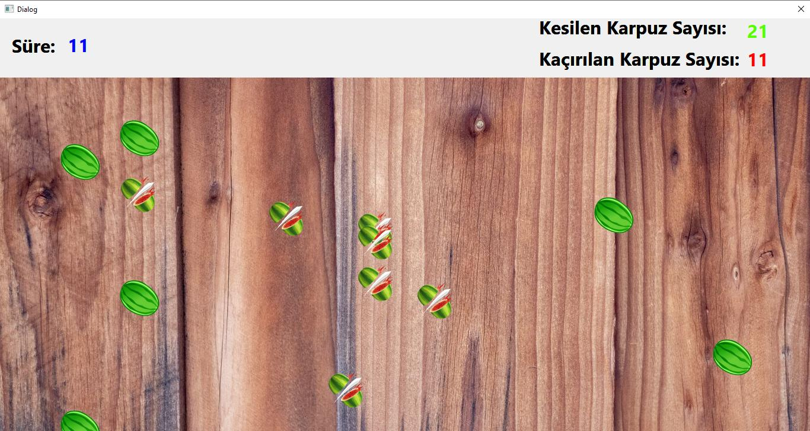

# Fruit Ninja Klonu
Qt ve C++ kullanılarak geliştirilmiş, basit bir Fruit Ninja tarzı masaüstü oyundur. Oyuncunun amacı 30 saniye içerisinde ekrana düşen karpuzları fare ile tıklayarak kesmektir. :contentReference[oaicite:0]{index=0}

## Özellikler
- **Rastgele Karpuz Oluşumu**  
  `konumlar.txt` dosyasındaki koordinatlara göre belli aralıklarla ekrana düşen karpuzlar.  
- **Karpuz Kesme Animasyonu**  
  Karpuza tıklandığında kesilmiş karpuz resmi gösterilir ve kısa süre sonra kaldırılır.  
- **Oyun İstatistikleri**  
  Süre (30 sn), kesilen karpuz sayısı ve kaçırılan karpuz sayısı ekranın üst kısmında canlı olarak gösterilir.  
- **Skor Kaydetme & Karşılaştırma**  
  Oyun sonunda `skorlar.txt` dosyasına kesilen karpuz sayısı kaydedilir; önceki skorlarla karşılaştırılarak “Maksimum Skoru Geçip Geçmediğiniz” bilgisi gösterilir.  
- **Tam Ekran ve Arka Plan**  
  QDialog/QMainWindow tam ekran; grafik arka planı Y=100 konumundan itibaren başlatılır.  
- **Ek Özellik (Örnek)**  
  Üye girişi ve skorların kullanıcı adına kaydedilmesi (dialog.cpp içinde yorum satırıyla işaretlenmiştir).  

## Ekran Görüntüleri
  
_Oyun esnasında düşen ve kesilen karpuzlar_

  
_Oyun bittiğinde maksimum skor geçilemediğinde çıkan bilgi kutusu_

  
_Oyun bittiğinde maksimum skorun aşıldığı durum_

